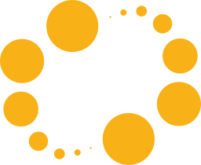

# Hey there! I'm Raf 

<h3><em>Software Engineer</em> with a guilty pleasure for breaking perfectly working code... just to see what happens. It's how my ADHD brain figures things out! 🧠💥</h2>

## About me

- 🔭 By day: Building stuff with JavaScript, Vue.js, and occasionally fixing what others break
- 🌱 By night: Learning C++, messing with React, and experimenting with 3D graphics
- 📸 Amateur photographer who occasionally captures something worth sharing ([check my Instagram](https://www.instagram.com/fearless_diamond/))
- 🎸 Been playing guitar for 3+ years (still can't play Wonderwall perfectly)
- 🚴 Love cycling, running, and enjoying an occasional beer afterward
- 🌍 Speaking in: English, Polish, and enough Japanese to order food
- 🐱 Fun fact: I once created a fake CMS login page that displayed Blini Cat staring at pancakes when credentials were entered. Security didn't improve, but team morale definitely did! 🥞

## Things I code with

## What I'm currently breaking... I mean building

- 🎮 Experimenting with Ogre 3D and WebGPU for game development (code first, graphics eventually)
- 🧩 Learning how static (`.a`) and shared (`.so`) libraries work in Linux - breaking stuff is the best way to learn!
- 🏗️ Building some React components with TypeScript that might actually survive my testing
- 🔍 Finding new ways to automate testing (because manually breaking things gets tiring)
- 🎨 Learning Blender for 3D modeling (so I can create assets to break in my game experiments)
- 📷 Exploring photography techniques when I need a break from screens

## Current obsessions

- Understanding low-level C++ memory management (pointers are both fascinating and terrifying)
- Exploring WebGPU and how it can revolutionize browser-based 3D graphics
- Mastering TypeScript's type system to catch bugs before they happen
- Making my Manjaro Linux setup work exactly how I want (it's a never-ending journey)
- Learning Blender shortcuts so I can actually finish a 3D model someday
- Optimizing my guitar practice routine (my neighbors probably wish I wouldn't)

## Let's connect!

If you're into breaking and fixing things too, let's collaborate! Or if you just want to chat about code, guitar, cycling, or recommend a good beer - I'm always up for that too. 🍻
